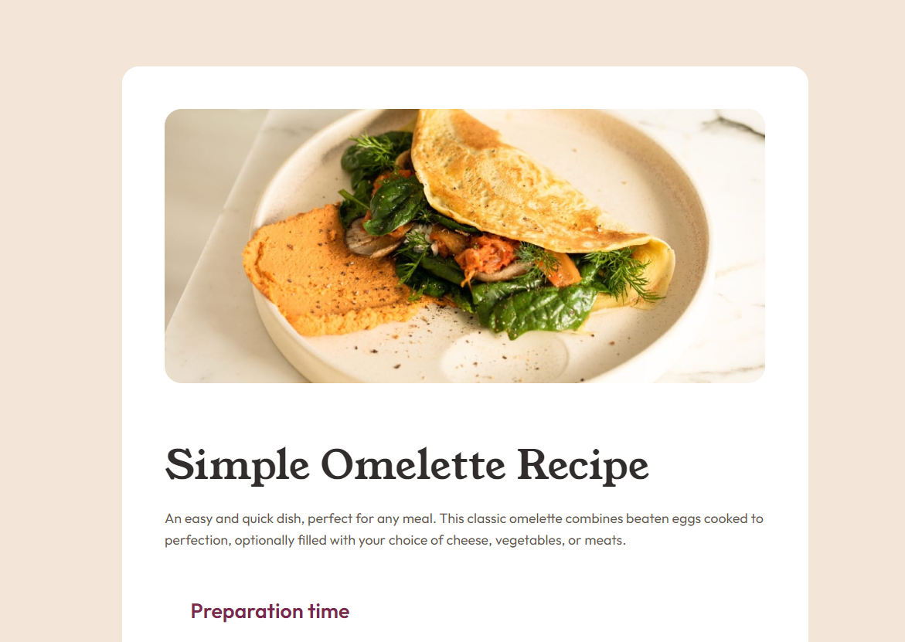

# Frontend Mentor - Recipe page solution

This is a solution to the [Recipe page challenge on Frontend Mentor](https://www.frontendmentor.io/challenges/recipe-page-KiTsR8QQKm). Frontend Mentor challenges help you improve your coding skills by building realistic projects. 

## Table of contents

- [Overview](#overview)
  - [The challenge](#the-challenge)
  - [Screenshot](#screenshot)
  - [Links](#links)
- [My process](#my-process)
  - [Built with](#built-with)
  - [What I learned](#what-i-learned)
- [Author](#author)

## Overview

### Screenshot



### Links

<!-- - Solution URL: [Add solution URL here](https://your-solution-url.com) -->
- Live Site URL: [MrLanter Live Site](https://mrlanter.github.io/omelette-recipe-page-FrontendMentor/)

## My process

### Built with

- Semantic HTML5 
- CSS custom properties
- Flexbox
- SCSS and SASS

### What I learned

I learned how to use SCSS and SASS and how to fix a bug with SCSS:

Since I was giving a link to the text font with
```
@font-face {
  src: url('../../')
}
```

When compiling the link was not good, so solution:
```
@font-face {
  src: url('/');
}
```

**BUT**, when I ran the index.html with github pages and the links didn't work, so my real solution was to import the links from _typography.scss but pretending I was importing them from the main.css. Which fixed the compilation issues nicely.

## Author

- Frontend Mentor - [@MrLanter](https://www.frontendmentor.io/profile/MrLanter)
